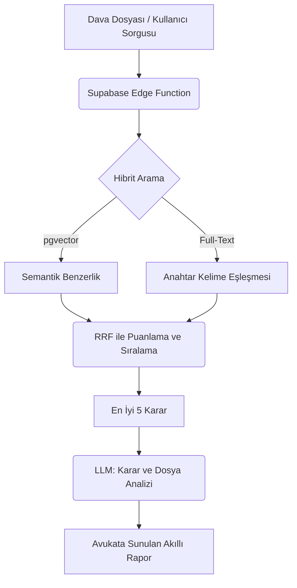

# Hibrit RAG (Yapay Zeka Destekli İçtihat Analizi) Stratejisi

Hukuk teknolojilerinde (LegalTech) "nokta atışı kelimelerin" ve "kavramsal bağlamın" aynı anda kusursuz çalışması gerekir. Bu doküman, Laawos projesi için tasarlanan Hibrit RAG (Retrieval-Augmented Generation) altyapısının vizyonunu ve kullanım senaryolarını içermektedir.

---

## 1. Neden Hibrit Yaklaşım?

> [!WARNING]
> Hukuk alanında sadece Semantik (Vektör) arama veya sadece Kelime (Keyword) araması yapmak ölümcül hatalara yol açabilir.

- **Sadece Vektör (Anlamsal) Arama:** "İşçinin haksız yere kovulması" diye arattığınızda, içinde "fesih, tazminat, işe iade" geçen harika kararlar bulur. Ancak avukat spesifik olarak *"TCK 125"* veya *"Yargıtay 9. Hukuk Dairesi 2021/456 E."* aradığında vektörler çuvallayabilir, çünkü sayılar anlamsal olarak birbirine benzerdir.
- **Sadece Kelime (BM25 / Keyword) Arama:** Geleneksel sistemler (Mevzuat/Sinerji vb.) böyledir. Tam kelimeyi arar. "Araç değer kaybı" yazarsanız, "Otomobil hasar farkı" diyen mükemmel bir emsal kararı kaçırabilirsiniz.
- **Hibrit Çözüm (Laawos Yaklaşımı):** İkisini birleştirip **Reciprocal Rank Fusion (RRF)** algoritmasıyla harmanlarız. Böylece hem kelimesi kelimesine madde numaralarını/esas numaralarını yakalarız hem de hukuki bağlamı anlarız.

---

## 2. Laawos'a Özel RAG Senaryoları

### A. Proaktif İçtihat Önerme (Otomatik RAG)
Avukat "İçtihat Arama" sekmesine gidip manuel bir arama yapmak zorunda kalmamalıdır. Sistem halihazırda dava dilekçesini okumuş ve olay örgüsünü kavramış durumdadır.
- **Nasıl Çalışır:** Avukat dosyaya girdiği anda, sistem arka planda dosyadaki olguları (örn: mobbing + fazla mesai) alıp veritabanındaki Yargıtay kararlarıyla eşleştirir. Ekranda proaktif olarak **"Bu dosyaya özel seçilmiş 3 Emsal Karar"** kutusu belirir.

### B. "Aleyhte Karar" Kalkanı (Red Team RAG)
Sadece lehte olan kararları bulmak, avukatı rehavete sürükleyebilir.
- **Nasıl Çalışır:** Avukat kendi savunma stratejisini kurduğunda, sistem veritabanına gidip **avukatın tezini çürütebilecek (aleyhte)** Yargıtay kararlarını bulur. 
  - *Örnek Sistem Uyarısı:* *"Dikkat, Yargıtay Hukuk Genel Kurulu 2023 yılında tam da sizin savunduğunuz durumun aksine bir karar vermiş. Karşı taraf bu kararı sunmadan önce şu anti-tezi hazırlamalısınız."*

### C. Akıllı Alıntı (Atıf) Enjeksiyonu
> [!TIP]
> Hallüsinasyon (uydurma) riskini sıfıra indiren en kritik özelliktir.
- **Nasıl Çalışır:** Dilekçe hazırlama ekranında (Drafting), avukat yapay zekaya *"Bana haksız tahrik indirimiyle ilgili bir savunma yaz"* dediğinde, yapay zeka körü körüne metin yazmaz. Önce veritabanındaki en güncel Yargıtay kararını bulur, karar metninden ilgili paragrafı kırparak **birebir alıntı olarak** dilekçenin içine enjekte eder.

### D. Yapılandırılmış Metin Parçalama (Structured Chunking)
Hukuki kararlar çok uzundur. Kararın tamamını tek bir parça (chunk) olarak vektör veritabanına atmak kaliteyi düşürür.
- **Nasıl Çalışır:** Kararlar veritabanına (Supabase pgvector) kaydedilirken mantıksal bölümlere ayrılır:
  1. Olayın Özeti
  2. Yerel Mahkeme Kararı
  3. Yargıtay'ın Gerekçesi
  4. Karşı Oy Yazısı (Muhalefet Şerhi)
- Bu sayede avukat *"Sadece muhalefet şerhlerinde geçen şu hukuki görüşü bul"* şeklinde çok spesifik aramalar yapabilir.

---

## 3. Teknik Altyapı Vizyonu

> [!NOTE]
> Laawos altyapısında halihazırda Supabase kullanıldığı için bu mimari doğrudan entegre edilebilir durumdadır.

1. **Veritabanı Seviyesi:** Supabase üzerinde hem `pgvector` (Semantik arama) hem de `Postgres Full-Text Search` (Kelime araması) aktif edilir.
2. **Birleştirme (Fusion):** İki farklı arama motorundan gelen sonuçları aynı anda çağıran ve RRF (Reciprocal Rank Fusion) ile puanlayan bir PostgreSQL Fonksiyonu yazılır.
3. **Yapay Zeka Yorumu:** Bulunan ilk 5 içtihat, doğrudan kullanıcıya sunulmak yerine bir ara LLM katmanına gönderilir. 
   - *Prompt:* *"Kullanıcının dosyası bu, bulduğumuz emsal kararlar bunlar. Bu kararların neden bu dosya için kritik olduğunu avukata 1 paragrafta açıkla."*

