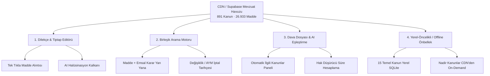

# AyrisLegal — CDN & Mevzuat Entegrasyon Stratejisi

**Tarih:** 22 Ağustos 2026  
**Durum:** 🟢 Onaylandı / Mimari Tasarım  
**Altyapı:** Supabase PostgreSQL (`mevzuat`, `mevzuat_madde`) + Cloudflare CDN (`cdn.ayrislegal.com`)

---

## 1. Mevcut Veri ve CDN Envanteri

AyrisLegal veritabanında ve CDN altyapısında halihazırda indekslenmiş, doğrulanmış ve kullanıma hazır hukuki külliyat bulunmaktadır:

| Varlık | Adet / Durum | Detay |
| :--- | :--- | :--- |
| **Toplam Kanun / Mevzuat** | **891 adet** | Türk Hukuku'nun tüm yürürlükteki kanunları |
| **Toplam Kanun Maddesi** | **26.933 adet** | Fıkralar, bentler ve yürürlük değişiklik notlarıyla tam metin |
| **CDN Kapsamı** | **%100 (26.933 dosya)** | `https://cdn.ayrislegal.com/mevzuat/kanun/.../madde-X.txt` |
| **CDN Durumu** | 🟢 **HTTP 200 OK** | Cloudflare Edge Caching ile global düşük gecikme |
| **Arama İndeksi** | `search_vector` | PostgreSQL Full-Text Search vektörleri hazır |

---

## 2. Dört Temel Entegrasyon Ekseni



---

### Eksen 1: 📄 Dilekçe Hazırlama (Drafting) & Tiptap Entegrasyonu

Avukatın dilekçe yazarken mevzuata ulaşmasını tek tık mesafesine indiren kullanıcı deneyimi:

1. **Tek Tıkla Mevzuat Alıntısı (Citation Injection):**
   - Tiptap araç çubuğuna **`⚖️ Mevzuat Ekle`** butonu ve hızlı arama kutusu eklenir.
   - Avukat `HMK 119` veya `TBK 49` seçtiğinde, maddenin en güncel resmi metni dilekçenin imleç konumuna standart **hukuki alıntı bloğu** (`blockquote`) olarak eklenir.
2. **Yapay Zeka Halüsinasyon Kalkanı (Context Injection):**
   - AI'ya *"İşe iade dilekçesi hazırla"* dendiğinde, backend davanın konusuna göre ilgili mevzuat maddelerinin (örn: *4857 İş Kanunu m. 18-21*) resmi CDN metinlerini prompt kontekstine ekler.
   - Yapay zeka kanun maddelerini uyduramaz, mülga (yürürlükten kalkmış) eski fıkraları yazamaz.
3. **Canlı Rehber / Madde Önizleme Çekmecesi:**
   - Dilekçe asistanındaki *"Zorunlu Unsurlar"* etiketlerine tıklandığında, ilgili kanun maddesinin tam metni sağ tarafta kayar panel (drawer) olarak açılır.

---

### Eksen 2: 🔍 Birleşik "İçtihat & Mevzuat Arama" Motoru

Ayrı ayrı arama yapmak yerine kanun ve o kanuna dayanan emsal kararları birleştiren hibrit arama:

1. **Akıllı Madde & Kanun Arama:**
   - Arama çubuğuna `6100 m. 119`, `TCK 86` veya `sebepsiz zenginleşme zamanaşımı` yazıldığında:
     - **Üst Kısım:** İlgili kanun maddesinin güncel metni ve fıkraları.
     - **Alt Kısım:** O maddeye atıf yapan en güncel **Yargıtay / Danıştay emsal kararları**.
2. **Mevzuat Değişiklik Tarihçesi:**
   - Maddelerin altında yer alan kanun değişiklikleri ve Anayasa Mahkemesi (AYM) iptal kararları avukata zaman çizelgesi olarak sunulur.
   - Örnek: *"Bu fıkra 7499 sayılı Kanun ile 01.06.2024 tarihinde değişmiştir."*

---

### Eksen 3: ⚖️ Dava Dosyası (CaseDetail) & Otomatik Eşleştirme

Dava dosyası açıldığı anda dosyanın hukuki zeminini otomatik hazırlama:

1. **Dava Türüne Özel Mevzuat Paketi:**
   - Dava türü *Boşanma / TMK 166* veya *Trafik Kazası Tazminatı / KTK 85 & TBK 49* olduğunda dosya ekranının sağında **"Dosya Mevzuat Rehberi"** belirir.
2. **Hak Düşürücü Süre & Zamanaşımı Takibi:**
   - İlgili kanun maddesinde geçen kesin süreler (*"tebliğden itibaren 2 hafta"*, *"öğrenmeden itibaren 1 yıl"*) otomatik analiz edilir ve Duruşma Takvimi'ne tek tıkla hatırlatıcı olarak atanabilir.

---

### Eksen 4: ⚡ Yerel-Öncelikli (Local-First / Offline) Hibrit Önbellekleme

Adliyede veya duruşma salonunda internet kesintilerine karşı sıfır gecikme:

1. **Temel Kanunlar Paketi (Offline SQLite):**
   - Türkiye'de dava trafiğinin %90'ını kapsayan **15 Temel Kanun** (*HMK, CMK, TCK, TMK, TBK, İİK, İYUK, TTK, İŞK, KTK, HMK Gider Avansı Tarifesi vb.*) uygulamanın yerel SQLite veritabanında saklanır.
   - İnternetsiz ortamda **0 milisaniye** hızında arama ve okuma yapılır.
2. **Nadir Kanunlar İçin CDN On-Demand Yükleme:**
   - Özel ihtisas kanunları (örn: *Maden Kanunu, Sermaye Piyasası Kanunu*) ilk arandığında `cdn.ayrislegal.com` üzerinden anlık olarak çekilir ve yerel önbelleğe kaydedilir.

---

## 3. Uygulama Yol Haritası (Fazlar)

```
[x] [FAZ 1] Dilekçe & Editör Entegrasyonu (YAPILDI)
  ├── [x] Tiptap "Mevzuat Ekle" aracı (26.900+ madde arama & tek tıkla alıntı)
  └── [x] Modal üzerinden hızlı kanun seçimi & CDN doğrulamalı metin önizleme

[x] [FAZ 2] Birleşik Mevzuat Arama Arayüzü (YAPILDI)
  ├── [x] İçtihat ve Kanun maddelerini üst sekmede birleştirme (MevzuatSearchView)
  ├── [x] 891 Kanun ve 26.933 Madde için anlık FTS ve Madde No filtreleme
  └── [x] Kanun maddesinden ilgili Yargıtay emsal kararlarına doğrudan geçiş köprüsü

[x] [FAZ 3] Yerel SQLite Önbellek (Offline Mod) (YAPILDI)
  ├── [x] IndexedDB ve yerel cihaz deposu ile çevrimdışı mevzuat motoru (`mevzuatOfflineStore.ts`)
  ├── [x] Temel kanun maddelerinin ilk getirmede otomatik yerel belleğe alınması
  └── [x] İnternetsiz/offline adliye ortamında anında arama ve dilekçeye alıntı yapabilme

[x] [FAZ 4] Dava Dosyası Otomasyonu (YAPILDI)
  ├── [x] Dava detay sayfasında (CaseDetail) tespit edilen mevzuat maddeleri interaktif kart görünümü
  └── [x] Dayanak maddeden tek tıkla doğrudan dilekçe stüdyosuna geçiş ve taslak başlatma
```

---

*Bu strateji dokümanı AyrisLegal çekirdek mimarisinin bir parçasıdır.*
